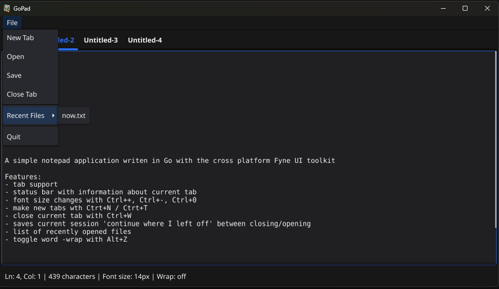

# FynePad



## Uses Fyne as a GUI toolkit
https://fyne.io/

Fyne is pretty nice for cross platform app development.
It's way more limiting than something like Electron.
But its decent in terms of resource usage.
I found that Wails was the most flexible and used the least resources. 

| Toolkit  | Binary Size | Memory Used |
| -------: | :---------: | :---------: |
| Fyne     | ~40 MB      | ~125 MB     |
| Electron | ~200 MB     | ~500 MB     |
| Wails    | ~10 MB      | ~10 MB      |


## Fedora 42 Dependencies
```sh
# Linux deps (X11)
sudo dnf install libX11-devel libXrandr-devel libXcursor-devel libXinerama-devel libXi-devel libXxf86vm-devel libX11-devel
sudo dnf install mesa-libGL-devel

# Windows deps
sudo dnf install mingw64-gcc mingw64-crt mingw64-winpthreads mingw64-windows-default-manifest
```

## Compilation
```sh
# for linux
go build -o gopad

# for Windows
CGO_ENABLED=1 GOOS=windows GOARCH=amd64 CC=x86_64-w64-mingw32-gcc go build -o gopad.exe
```

## Packaging
```sh
# bundles executable with icon
go install fyne.io/tools/cmd/fyne@latest
export PATH=$PATH:$HOME/go/bin
GOOS=windows CC=x86_64-w64-mingw32-gcc fyne package -os windows -name gopad.exe
```
